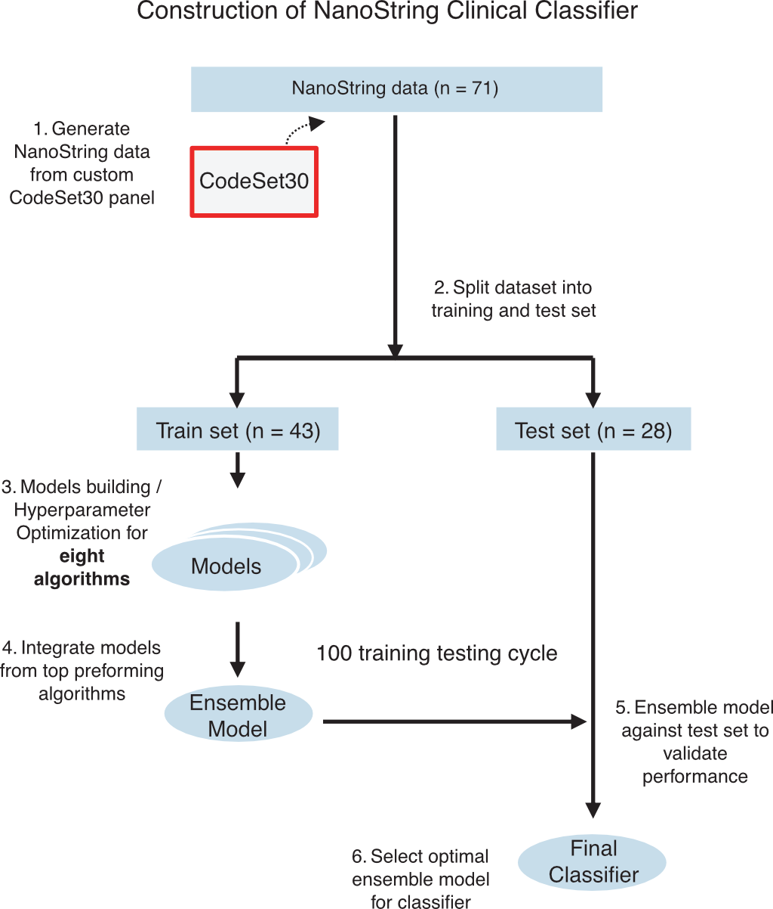
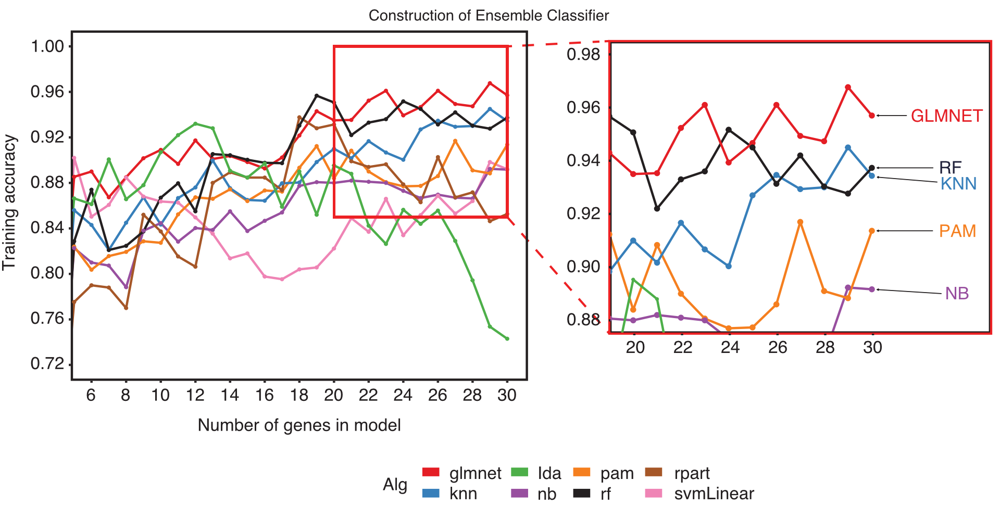
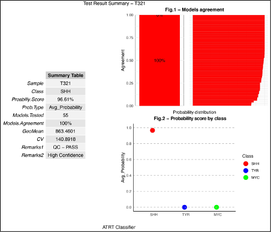
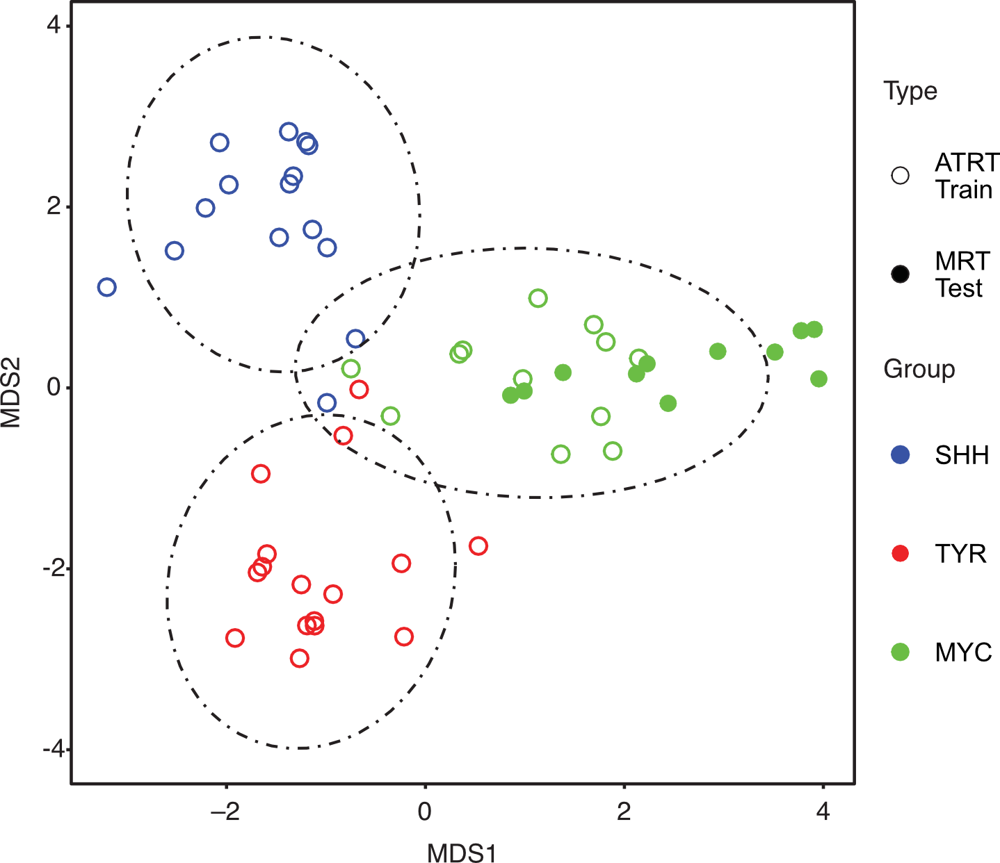

```{r, include = FALSE}
knitr::opts_chunk$set(
  collapse = TRUE,
  comment = "#>"
)
```

# Introduction

`AClass` is an R package designed for robust tumor subgroup classification using transcriptomic data, especially for small-cohort settings such as NanoString nCounter. Originally developed for Atypical Teratoid Rhabdoid Tumor (ATRT) classification, the motivation behind AClass is to enable robust subgroup classification in clinical settings when working with limited sample size, degraded/archival RNA, or cost- and time-sensitive workflows. To address this, AClass implements an ensemble classification strategy over a minimal biomarker panel.

```{r fig2a, echo=FALSE, fig.cap="AClass training and classification schema (Fig.2a).", out.width='75%'}

```

## How It Works

AClass uses an ensemble classifier strategy optimized for small-cohort transcriptomic data. The workflow includes:

- **Subgroup signature gene list**: A minimal panel of overexpressed genes used to distinguish subgroups. The default [CodeSet30](https://github.com/SplitInf/AClass/blob/main/inst/extdata/CodeSet30.tsv) was derived from differential expression in ATRT samples.
- **Model selection**: The ensemble classifier is constructed with a mix of machine learning algorithms evaluated across a range of gene subset sizes. In the original publication, the top 5 algorithms (rf, pam, glmnet, nb, knn) over 20-30 genes were used to create a total of 55 classification models. Pre-trained models are included with the package.
- **Ensemble prediction**: Classification is based on hard voting among models. The predicted group is determined by majority, and a probability score reflects agreement among classifiers.

```{r fig2b, echo=FALSE, fig.cap="Model selection accuracy plot: 8 algorithms vs number of genes (Fig.2b).", out.width='75%'}

```
# 1. Quick Start

This minimal example uses demo data to classify samples using a pre-trained model.

```{r eval=FALSE}
library(AClass)
data(models)
data(test_obj)

work_path <- "/Your/Work/Path"
test_obj <- classify.data(
  work_path = work_path,
  data = test_obj,
  prefix = "demo",
  training_model_obj = models
)

# View summary
head(test_obj$test_summary)
```

# 2. Input Requirements

- **NanoString RCC files** or **expression matrix**
- (Optional) Group labels for training
- (Optional) Pre-ranked probe list for custom training

If using your own expression matrix, it should be:
- Rows = samples
- Columns = genes/features
- Include a column named `Group` if supervised training is needed

# 3. Full Workflow

## 3.1 Preprocess Raw Data

```{r eval=FALSE}
work_path <- "/Your/Work/Path"
test_raw_path <- system.file("extdata", package = "AClass") #demo data containing samples profiled with different chemistry
project_name <- "demo"

# Load RCC or NanoString expression text files
test_data <- process.raw(work_path, prefix = project_name, raw_path = test_raw_path)
```

## 3.2 Optional: Train Custom Model

In this example, we will split 80% of the data for training and 20% for validation.
The resulting AClass object will contain new slots: `train.data.main` and `train.data.validate`.

Note: This toy dataset is provided to illustrate the training workflow. In real applications, appropriate sample size and balanced subgroup representation are essential.


```{r eval=FALSE}

#split data into training and validation
train <- nano.trainsplit(test_data, training_memberships_path, N.train.per = 0.8)
```

The data is now ready for training. This step can be time consuming so we will just use two algorithms (random forest and pam) and 3 feature combination (28 to 30 genes) to demonstrate. A total of 6 models will be generated.

`probes_rank_path` is the path to probe/gene ranking list, one gene per line. Ideally the list should be sorted E.g. gene list sorted by p value (most significant to least). By default it looks for file called `probes_list.txt`.

```{r eval=FALSE}

#path to files used in the tutorial
aclass_files_path <- system.file("extdata", package = "AClass")

#demo ranking file for CodeSet30
probes_rank_path <- paste(aclass_files_path,"probes_list_hgnc.txt",sep= "/")

#shows path location
probes_rank_path

#create ensemble model
models <- nano.train(
  prefix = project_name,
  data = train,
  work_path = work_path,
  probes_rank_path = probes_rank_path,
  alg_list = c("rf","pam"),
  min_test_features=28, 
  max_test_features=30
)

# Get training information from model
nano.train.report(prefix = project_name, training_model_obj = models)
```

## 3.3 Classify Samples

AClass object can be classified using any expression matrix. If you have NanoString data on CodeSet30, you can simply use the pre-trained model that comes with the package
Note: It is highly recommended that training and testing data are normalized the same way to minimize batch effect.


```{r eval=FALSE}
# Using pre-trained models
data(models)

# Get training information from model
get.training.stats(training_model_obj = models) # obtain model information

# Generate training report and pull out information about the models.
nano.train.report(prefix=project_name, training_model_obj=models, feature_min=20, feature_max=30)

#test
test_obj <- classify.data(
  work_path = work_path,
  data = test_data,
  prefix = project_name,
  training_model_obj = models
)

```

```{r figs3b, echo=FALSE, fig.cap="Example classification report output (Fig.S3b).", out.width='50%'}

```

# 4. Understanding Outputs

The AClass object is a structured list containing data and results in different 'slots' that is used through out the workflow.

## Core Slots:

From `process.raw()`:

- `raw`: original NanoString data
- `prenorm_qc`: QC statistics before normalization. E.g. housekeeping genes Mean and GeoMean expression to estimate quality.
- `norm`: data normalized to housekeeping genes by `NanostringNorm`.
- `norm.t`: same as `norm` but transposed.

From `nano.trainsplit()`:

- `train.data.main`: Data used for training
- `train.data.validate`: Held off data for validation

From `classify.data()`:

- `test_summary`: Final class assignments and prediction scores.
- `test_results`: Aggregated majority vote results.
- `test_results_full`: All predictions across models.
- `colour_code`: Subgroups and color code for reports and visualizations.

Log:

- `run_info`: Log information on operations performed on AClass object. From process.raw(), classify.data()

## Interpreting results:
- `Agreement == 1`: unanimous classifier consensus
- `Avg_Probability`: confidence score (0–1)
- `GeoMean`: Geometric means of housekeeping gene expression for quality assessment. Default is 100 for NanoString data to be considered high quality.

# 5. Visualization Tools

## Static MDS Plot

MDS (Multidimensional Scaling) plots visualize similarity between samples based on expression profiles.

```{r eval=FALSE}
nano.MDS(prefix = project_name, data = test_obj, plot_type = "ggplot")
```

## Interactive Plot
```{r eval=FALSE}
nano.MDS(prefix = project_name, data = test_obj, plot_type = "plotly")
```

## Train/Test Comparison
```{r eval=FALSE}
nano.MDS.train.test(
  prefix = project_name,
  train.data = models,
  test.data = test_obj,
  colour_code = test_obj$colour_code,
  plot_type = "plotly"
)
```

```{r fig3d, echo=FALSE, fig.cap="MDS plot of MRT samples vs ATRT reference (Fig.3d).", out.width='50%'}

```

# 6. Support for Gene expression matrix, RNASeq or GEO Data

You can adapt `df2nano()` for microarray or RNA-seq datasets. See [vignette part2](https://htmlpreview.github.io/?https://github.com/SplitInf/AClass/blob/main/doc/tutorial2.html) for full Affymetrix demo with `GSE70678`.

```{r eval=FALSE}
exprs_df <- getGEO("GSE70678", GSEMatrix = TRUE)[[1]] |> exprs()
# Map probes -> gene symbols, aggregate, format
# Then:
df <- df2nano(formatted_matrix, add_to = "train.data.main")
```

# 7. Citation

If you use `AClass` or `CodeSet30`, please cite:

> Ho B, Arnoldo A, Zhong Y, et al. Rapid, economical diagnostic classification of ATRT molecular subgroup using NanoString nCounter platform. *Neuro-Oncology Advances*. 2024. [doi:10.1093/noajnl/vdae004](https://doi.org/10.1093/noajnl/vdae004)
